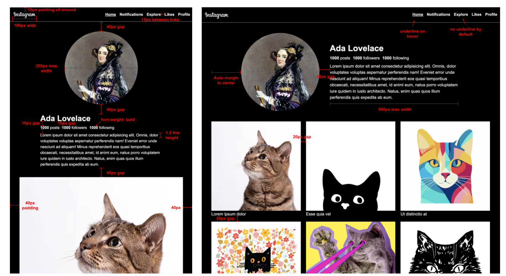

# Checkpoint 3 - HTML & CSS (Instagram Profile)

- [Overview](#overview)
- [Setup](#setup)
- [Design Specifications](#design-specifications)
  - [Guiding Questions](#guiding-questions)
  - [Style Guide](#style-guide)
  - [Additional Design Notes](#additional-design-notes)
- [Grading Guide \& Submission](#grading-guide--submission)
  - [Technical Requirements](#technical-requirements)
  - [Submission](#submission)
- [CSS Cheatsheet](#css-cheatsheet)
  - [Colors](#colors)
  - [Typography (Text Styling)](#typography-text-styling)
  - [CSS Variables](#css-variables)
  - [Box Model (Spacing \& Sizing)](#box-model-spacing--sizing)
  - [Layout](#layout)
  - [Interactive States (Pseudo-classes)](#interactive-states-pseudo-classes)
  - [Flexbox](#flexbox)
  - [Grid](#grid)
  - [Media Queries](#media-queries)

## Overview

In this checkpoint, you will be building and styling an **Instagram-style profile page** using HTML, Flexbox, and Grid from scratch using nothing more than a design document to reference!

Use the previous assignment to see the patterns for how to structure your page and how to use flexbox/grid to style the page.

**What's Provided:**
- The design spec (`design-spec.png`)
- Empty HTML file (`src/index.html`)
- CSS reset (`src/style.css`)
- Images in the `src/img/` folder (logo, profile picture, and cat photos for posts)

**Your Task:**
- Build the entire HTML content and structure
- Write CSS to match the design specifications
- Use CSS Grid and Flexbox for the appropriate sections

## Setup

1. Open the `src/index.html` file in your browser and set up the boilerplate (type `html:5` and hit enter)
2. Write your HTML in `src/index.html` and CSS in `src/style.css`
3. Refresh the browser frequently to see your changes

**Tips:**
- Use your browser's Developer Tools (right-click > Inspect) to debug CSS issues
- Resize your browser window to test responsive behavior
- If a style isn't working, check for typos and missing semicolons!

## Design Specifications

Use the spec diagram below and the following style guide to build your page (see `design-spec.png`)



### Guiding Questions

Before you start coding, take a moment to analyze the design:

**HTML Structure:**
- What are the main sections of this page? How can you use semantic elements (`header`, `main`, `footer`, `section`, `nav`) to structure your HTML?
- What repeating patterns do you see? How might you use lists (`ul`, `li`) to represent them?
- Where do you see images with captions? What HTML element is best for that?

**Layout Strategy:**

You *must* use both flexbox and grid in this project.
- Where do you see elements arranged in a single row or column? These are good candidates for **Flexbox**.
- Where do you see elements arranged in a two-dimensional grid pattern (rows AND columns)? These are good candidates for **CSS Grid**.

**Responsive Design:**
- How is the layout different for mobile and desktop screens?

### Style Guide

Use the following fonts and colors for this project:

- Font family: `Arial, sans-serif`
- Light text / border color: `#f5f5f5` (light grey)
- Background color: `black`

And use the following breakpoints to create a responsive design
- Mobile-first design with 1 column
- At 768px switch to 2 columns
- At 992px switch to 3 columns

### Additional Design Notes

- The navigation links should be white, with the underline text decoration removed by default. When the user hovers over the link, the underline should appear.
- The text for the bio and for the picture captions can be any text of your choosing. **TIP:** For the bio, you can type `lorem100` and hit enter to insert 100 words. You can do the same for the picture captions with a lower number like `lorem3`.

## Grading Guide & Submission

### Technical Requirements

**HTML Structure:**
- [ ] Uses semantic HTML elements (`header`, `main`, `footer`, `section`, `nav`)
- [ ] Uses lists (`ul`, `li`) to represent repeating content (nav links, stats, posts)
- [ ] Uses `figure` and `figcaption` for images with captions

**CSS Layout:**
- [ ] Uses Flexbox (`display: flex`) on at least 3 different elements
- [ ] Uses CSS Grid (`display: grid`) for the posts section
- [ ] Uses `gap` to create consistent spacing between elements

**Responsive Design:**
- [ ] Uses media queries to create a responsive layout
- [ ] Posts grid displays 1 column on mobile, 2 columns at 768px, 3 columns at 992px
- [ ] Hero section layout changes between mobile (stacked) and desktop (side-by-side)

**General Styling:**
- [ ] Passes the "eye test" (without looking at the code or inspecting closely, the page looks like it matches the design spec)
- [ ] Uses CSS Variables to store colors and avoid repetition
- [ ] Padding, margins, and gaps match the design specification
- [ ] Navigation links underline on hover

### Submission

When you are finished:
1. Save all your files
2. Commit your changes with a descriptive message
3. Push to your repository
4. Make a pull request and tag your instructors for review
5. Submit the link to your pull request

## CSS Cheatsheet

Use this as a reference while working. **You don't need to memorize these!**

### Colors

| Property                           | What It Does          | Example                |
| ---------------------------------- | --------------------- | ---------------------- |
| `color`                            | Sets text color       | `color: midnightblue;` |
| `background` or `background-color` | Sets background color | `background: azure;`   |

Color values can be: named colors (`red`, `blue`), hex codes (`#FF5733`), or RGB (`rgb(255, 87, 51)`).

### Typography (Text Styling)

| Property          | What It Does                | Example                           |
| ----------------- | --------------------------- | --------------------------------- |
| `font-family`     | Sets the font               | `font-family: Arial, sans-serif;` |
| `font-size`       | Sets text size (use `rem`!) | `font-size: 1.5rem;`              |
| `font-weight`     | Sets boldness               | `font-weight: bold;`              |
| `font-style`      | Sets italic                 | `font-style: italic;`             |
| `text-align`      | Aligns text                 | `text-align: center;`             |
| `text-decoration` | Adds/removes underlines     | `text-decoration: none;`          |

### CSS Variables

**CSS Variables** are reusable values you define once and use throughout your CSS. This is helpful for consistent colors, fonts, and easy updates.

**Example:**
```css
:root {
  --color-background: #181818;
  --color-accent: #1db954;
  --color-text: #fff;
  --font-family: Arial, sans-serif;
}
```

**Usage:**
```css
body {
  background: var(--color-background);
  color: var(--color-text);
  font-family: var(--font-family);
}

a:hover {
  color: var(--color-accent);
}
```

Define your variables at the top of your `style.css` inside the `:root` selector, then use them everywhere you reference colors, fonts, or repeated values.

### Box Model (Spacing & Sizing)

| Property                                                     | What It Does                 | Example                           |
| ------------------------------------------------------------ | ---------------------------- | --------------------------------- |
| `width`                                                      | Sets element width           | `width: 300px;`                   |
| `max-width`                                                  | Sets maximum width           | `max-width: 600px;`               |
| `padding`                                                    | Space INSIDE the border      | `padding: 20px;`                  |
| `margin`                                                     | Space OUTSIDE the border     | `margin: 10px;`                   |
| `border`                                                     | Creates a border (all sides) | `border: 2px solid black;`        |
| `border-top`, `border-bottom`, `border-left`, `border-right` | Border on one side           | `border-bottom: 2px solid black;` |
| `border-radius`                                              | Rounds corners               | `border-radius: 8px;`             |

**Shorthand for padding/margin:**
- `padding: 10px;` → all sides
- `padding: 10px 20px;` → top/bottom, left/right

### Layout

| Property       | What It Does                             | Example             |
| -------------- | ---------------------------------------- | ------------------- |
| `margin: auto` | Centers a block element (needs a width!) | `margin: auto;`     |
| `list-style`   | Styles/removes list bullets              | `list-style: none;` |

### Interactive States (Pseudo-classes)

```css
/* When mouse hovers over element */
a:hover {
  background: lightblue;
}
```

### Flexbox

| Property          | What It Does                              | Example                          |
| ----------------- | ----------------------------------------- | -------------------------------- |
| `display: flex`   | Makes the element a flex container        | `display: flex;`                 |
| `flex-direction`  | Sets direction: `row` (default), `column` | `flex-direction: column;`        |
| `justify-content` | Spacing along the **main axis**           | `justify-content: space-between` |
| `align-items`     | Alignment along the **cross axis**        | `align-items: center;`           |
| `gap`             | Space **between** flex items              | `gap: 20px;`                     |

**Common `justify-content` values:** `flex-start`, `flex-end`, `center`, `space-between`, `space-around`, `space-evenly`

**Common `align-items` values:** `flex-start`, `flex-end`, `center`, `stretch` (default)

### Grid

| Property                | What It Does                     | Example                             |
| ----------------------- | -------------------------------- | ----------------------------------- |
| `display: grid`         | Makes the element a grid         | `display: grid;`                    |
| `grid-template-columns` | Defines column sizes             | `grid-template-columns: 1fr 1fr;`   |
| `gap`                   | Space between grid items         | `gap: 20px;`                        |

**The `fr` unit** divides available space into fractions. `1fr 1fr 1fr` creates 3 equal columns.

### Media Queries

```css
/* Styles for screens 768px and wider */
@media (min-width: 768px) {
  .selector {
    /* styles here */
  }
}
```
